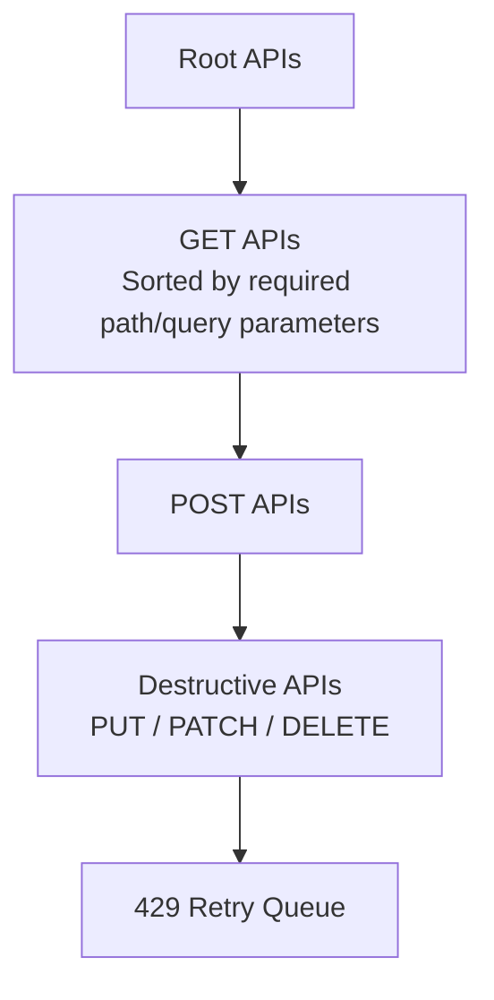

# Swagger Knows the Endpoints. It Doesn't Know the Workflow.

I thought parsing an OpenAPI specification would be the easy part. Parsing wasn't the problem at all. The real challenge was teaching a machine how APIs depend on one another.

At Akto, one of the ways customers onboard their APIs is by uploading an OpenAPI specification. We already parsed it and extracted every endpoint, so coverage looked fine. The extracted APIs just weren't useful. Most generated requests carried placeholder values like `"string"` or `0`. GET endpoints returned empty resources because nothing had been created beforehand. POST requests failed validation because their payloads matched the schema but not the business rules the backend actually enforced.

That broke a downstream testing service. It replays captured API traffic with payload mutations to find security issues, and if the original request isn't valid, every replay ends in a `422` or a `5xx`.

We validated everything that follows across multiple customer specifications, each containing roughly **400–500 APIs**, spanning very different products and API styles. Those differences mattered more than I expected.

## The first attempt

I started with the most naive thing available: generate requests directly from the schema, populate every parameter with placeholder values, generate a second variant without optional parameters, replay every endpoint. It was meant as a baseline.

About **10%** of APIs executed successfully.

The pattern in the successes was the interesting part. Almost all of them were independent endpoints. They either required no request body or had no mandatory query or path parameters. They didn't depend on application state existing beforehand. Everything else failed because the data it expected didn't exist yet.

## APIs aren't independent

I had been thinking in endpoints. The system was a workflow. Most REST APIs follow CRUD semantics: a resource is created, retrieved, updated, eventually deleted. Each endpoint expects state produced by another endpoint.

Once the specification is a graph rather than a list, the first move is obvious. Identify **root APIs**, the endpoints that execute without relying on any previously created resource, and start there. They populate the initial dataset by creating users, organizations, projects, API keys, tokens, whatever the rest of the surface depends on. Every successful response gets stored so its fields can be reused when constructing later requests.

Ordering execution that way alone took us from 10% to roughly **22%**.

## Building the dependency graph

Discovering how APIs relate was harder. Some relationships are safe assumptions: if a service exposes `POST /users`, then `PUT /users/{id}` and `DELETE /users/{id}` probably depend on it. Real specifications aren't that consistent. One service exposes `{userId}`, another `{id}`, a third calls the same identifier `{memberId}` or `{uuid}`. Exact string matching broke down immediately.

So I tokenized endpoint paths, normalized resource names, and added a similarity layer that could infer relationships despite inconsistent naming. Method ordering was a second signal, since CRUD implies its own sequence.

The strongest signal was much simpler than any of that: the response data. Whenever a response contained a `userId`, `organizationId` or any other identifier, we cached it, and future requests searched that cache while building payloads. A `userId` from one endpoint satisfies the path parameter of another. An organization created by one API can make ten previously failing APIs executable. Every success expanded the pool of valid data for everything after it.

That reached roughly **34%**. I thought the hard part was done.

## The long tail

The remaining failures looked nothing like the earlier ones. Parameters whose names had no relationship to anything we'd seen. Regex patterns and business rules that appeared nowhere in the specification. Dependencies on setup APIs that weren't documented as dependencies. Schemas the implementation had drifted away from.

The available move was to keep adding heuristics: another matching rule, another synonym dictionary, another special case. I rejected that, and the reason is the only one that mattered here. Each new heuristic solved one customer while making the system more complex for every other customer. That's trading generality for a support ticket, repeatedly.

The parser wasn't failing because it couldn't understand the specification. It was failing because the specification didn't describe how the application behaved.

## An agent, scoped to recovery only

Dependency ordering, parameter extraction, request generation and caching were working for the majority of APIs, so replacing them was never on the table. What remained was long tail: hidden business rules, incomplete documentation, undocumented workflows.

The AI layer only runs after the normal pipeline has already failed. Deterministic logic owns the common path; the agent handles exceptions.

Rather than asking it to "generate a valid request," I wanted it reasoning about *why* the request failed. Every recovery attempt included the original request and response, the status code and error, the declared dependencies, previously extracted parameters, and public product documentation when the customer provided it.

Recovery ran in two phases, in this order deliberately:

**Phase A** examines only the dependencies already declared in the specification, and may suggest up to two that should execute before the retry. Most straightforward cases resolve here.

**Phase B** drops that restriction and lets the agent inspect the entire API catalog, prioritizing endpoints likely to create the missing state.

Phase A comes first because the declared dependency graph is the developer's stated intent. The agent only gets to reason past it once that intent has proven insufficient.

### The case that justified the whole layer

One customer exposed an endpoint retrieving **scheduled subscription changes**. Every request to it returned **422 Unprocessable Entity**. The specification declared three prerequisite APIs. Recovery executed all three, retried, and it still failed.

Phase B searched the full catalog and the documentation, found a different endpoint for updating a subscription, and inferred that this endpoint only produced the required state when called with one specific combination: update the subscription's item price, and set `change_option=end_of_term`.

Once that ran, the original retrieval endpoint started succeeding immediately.

None of that relationship existed in the specification. The declared dependencies weren't wrong, they were insufficient. Finding it required combining execution history, documentation, and the semantics of neighbouring endpoints, which is precisely the shape of problem I could not have encoded as a heuristic without making it brittle.

### What if the agent is wrong

This was the first question the team asked. Nothing happens. If the agent suggests a dependency that fails, or one that doesn't improve the outcome, we treat it as an ordinary unsuccessful attempt. The original API stays unresolved and execution continues.

The agent can raise the success rate. It was never permitted to make the system less predictable.

## Execution order

The final ordering:

Root APIs populate the initial dataset. GET APIs enrich the parameter cache before anything mutates. POST APIs create resources for downstream requests. Destructive APIs are delayed so they don't remove resources later APIs need. Rate-limited APIs get their own phase.

Reordering was folded into the jump from 34% to ~60% and I never isolated its individual contribution, which I should have. It's cheap to measure and I'd have known how much of that jump was free.

The 429 phase deserves its own note, because those requests weren't failures. Some APIs return **429 Too Many Requests** and just need time, and we were counting them as failed executions. Collecting them into a fifth phase, respecting `Retry-After`, and retrying with exponential backoff recovered endpoints that had looked broken.

## Preventing infinite dependency loops

Once APIs call other APIs, circular dependencies show up: A depends on B, B eventually depends on A, naive implementation recurses forever.

Every dependency resolution maintains a set of APIs currently being processed, and a dependency already in the chain terminates that branch. Traversal converges; legitimate nested dependencies still run.

Recovery follows the same rule: executing a dependency never triggers another recovery cycle. Dependencies get one attempt, and if they fail, they fail. That keeps execution deterministic and debuggable, at the cost of resolvable cases we choose not to chase.

## Results

| Approach                                                              | Successful APIs |
| --------------------------------------------------------------------- | --------------: |
| Direct request generation                                             |         **10%** |
| Root-first execution                                                  |         **22%** |
| Dependency graph traversal                                            |         **34%** |
| Final pipeline (dependency graph + AI recovery + rate-limit handling) |        **~60%** |

The remaining 40% aren't all parser failures. A significant portion sit behind feature flags, or are deprecated endpoints that no longer match the backend, or need environment-specific configuration and external prerequisites that can't be recreated from a specification. Past roughly 60%, each additional percentage point cost disproportionately more engineering effort, so we stopped.

What I'd defend from this project is the boundary, not the AI. The parser attempts deterministic execution first, always, and the agent is only reachable after that has exhausted itself. It can suggest dependencies, search documentation, and reason about failures. It cannot retry recursively, and it cannot take over the pipeline. Those constraints did more for the system's reliability than any prompt I wrote.

The specification was never the hard part. Reconstructing the workflow it only gestures at was.
