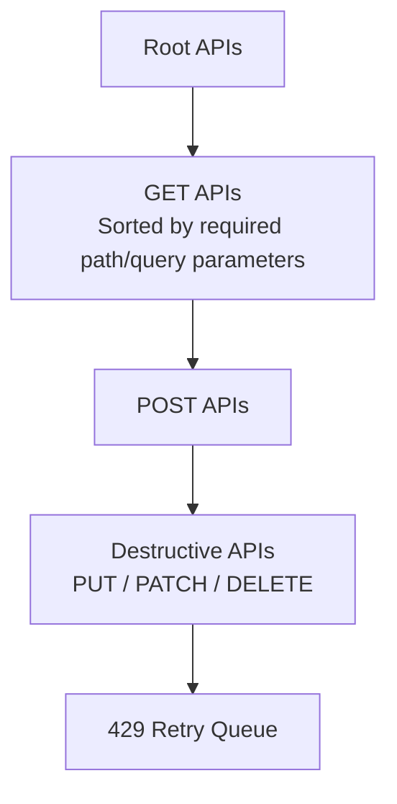

# Swagger Knows the Endpoints. It Doesn't Know the Workflow.

I thought parsing an OpenAPI specification would be the easy part. It turned out parsing wasn't the problem at all — the real challenge was teaching a machine how APIs depend on one another.

At Akto, one of the ways customers onboard their APIs is by uploading an OpenAPI (Swagger) specification. We already parsed the specification and extracted every endpoint, so from a coverage perspective, we were doing well. The problem was that the extracted APIs weren't particularly useful. Most generated requests contained placeholder values like `"string"` or `0`. GET endpoints returned empty resources because nothing had been created beforehand, while POST requests frequently failed validation because the payloads technically matched the schema but not the business rules enforced by the backend.

This became a bottleneck for one of our testing services. It replays captured API traffic with different payload mutations to identify security issues, but if the original requests themselves aren't valid, almost every replay ends in a `422` or `5xx` response.

The challenge was no longer parsing Swagger. The challenge was turning a static API specification into realistic API traffic.

We validated this approach across multiple customer OpenAPI specifications, each containing roughly **400–500 APIs**, spanning very different products and API styles. Those differences turned out to matter far more than I initially expected.

---

# The First Attempt

Like most engineering problems, I started with the simplest solution I could think of: generate requests directly from the OpenAPI schema, populate every parameter with placeholder values derived from the specification, generate another variant without optional parameters, and replay every endpoint. It was intentionally naive, but it established a baseline.

Only about **10%** of the APIs executed successfully.

After digging into the successful requests, an interesting pattern emerged. Almost all of them were independent APIs — they either required no request body or had no mandatory query or path parameters. In other words, they didn't depend on any application state being created beforehand. Everything else failed because the data they expected simply didn't exist yet.

That observation completely changed how I looked at the problem.

---

# APIs Aren't Independent

Initially, I was thinking in terms of endpoints. The real system, however, wasn't a collection of endpoints—it was a workflow. Most REST APIs naturally follow CRUD semantics: a resource is created, then retrieved, then updated, and eventually deleted. That means most APIs aren't independent requests. They're steps in a larger sequence, with each endpoint expecting some existing application state produced by another endpoint.

Once I started viewing the specification as a graph instead of a list, the next step became obvious. The first task was identifying **root APIs**—endpoints that could execute without relying on any previously created resources. These APIs became the starting point of the execution pipeline. They populated the initial dataset by creating users, organizations, projects, API keys, tokens, or whatever foundational resources the remaining APIs depended upon. Every successful response was stored, allowing its fields to be reused while constructing subsequent requests.

Simply executing APIs in this order increased successful parsing from **10% to roughly 22%**. It was progress, but it also highlighted that execution order alone wasn't enough.

---

# Building the Dependency Graph

The next challenge was discovering how APIs related to one another. Some relationships were straightforward — if a service exposes `POST /users`, it's usually safe to assume that `PUT /users/{id}` and `DELETE /users/{id}` depend on it. Unfortunately, real-world APIs rarely stay that consistent. Different teams follow different naming conventions: one service might expose `{userId}`, another simply uses `{id}`, and a third might call the exact same identifier `{memberId}` or `{uuid}`. Exact string matching quickly broke down.

Instead, I tokenized endpoint paths, normalized resource names, and introduced a lightweight similarity layer that could infer likely relationships despite inconsistent naming. It wasn't perfect, but it captured a surprisingly large number of dependencies across different APIs. Method ordering became another useful signal — CRUD operations naturally imply execution order, so when multiple endpoints operated on the same resource, create operations were prioritized before updates or deletes.

While this improved the graph structure, the strongest signal came from something much simpler—the response data itself. Every successful API execution became an opportunity to unlock the next one. Whenever a response contained values like `userId`, `organizationId`, `projectId`, or any other identifier, those values were extracted and stored in a cache, and future requests searched this cache while constructing their payloads. A `userId` returned from one endpoint could satisfy the path parameter of another; an organization created by one API could suddenly make ten previously failing APIs executable. Instead of generating requests in isolation, the parser slowly began traversing the API ecosystem as a connected graph, where every successful execution expanded the amount of valid data available for future requests.

That pushed successful execution to roughly **34%**. At this point, I felt we had solved the hard part.

I was wrong.

---

# The Long Tail of Edge Cases

The remaining failures looked completely different. Some APIs expected parameters with names that had no obvious relationship to previously observed values. Others enforced regex patterns or business rules that weren't represented anywhere in the OpenAPI specification. Some depended on setup APIs that weren't documented as dependencies at all, and others referenced outdated schemas where the implementation had drifted away from the specification over time.

Every failed request uncovered another edge case. The obvious solution was to keep adding heuristics — another string-matching rule, another synonym dictionary, another special case for a particular API pattern. But it became clear that this approach wouldn't scale. Each new heuristic solved one customer while making the system more complex for everyone else. The parser had reached a point where deterministic logic was producing diminishing returns.

That was when I started thinking about AI—not as the primary solution, but as a recovery mechanism for the cases where heuristics inevitably fell short.

# When the Dependency Graph Wasn't Enough

One thing was becoming increasingly clear: the parser wasn't failing because it couldn't understand the OpenAPI specification. It was failing because the specification didn't capture how the application actually behaved.

At this point, I had no intention of replacing deterministic logic with AI. The dependency graph, execution ordering, parameter extraction, and request generation were all working well for the majority of APIs. The remaining failures belonged to the long tail—cases where hidden business rules, incomplete documentation, or undocumented workflows made purely rule-based inference impractical.

Instead of teaching the parser hundreds of new heuristics, I introduced an **AI-assisted recovery layer** that was only invoked after the normal pipeline failed. The idea was simple: deterministic logic handled the common path, while AI handled the exceptions.

---

## Giving the Agent Context

Rather than asking the agent to "generate a valid request," I wanted it to reason about *why* the request had failed. Every recovery attempt included enough context for the agent to make an informed decision:

- The original request and response.
- The HTTP status code and error message.
- Dependencies declared in the OpenAPI specification.
- Previously extracted parameters from successful API executions.
- Public product documentation (when customers provided it).

The recovery itself happened in two phases.

### Phase A – Follow the Declared Dependency Graph

The agent first examined the dependencies already declared in the OpenAPI specification. It could suggest up to two dependency APIs that should be executed before retrying the original request. Most straightforward cases were resolved here.

### Phase B – Search Beyond the Graph

If the declared dependencies still didn't resolve the request, the recovery pipeline expanded its search. Instead of being limited to the dependency graph, the agent could inspect the entire API catalog, prioritizing APIs that were likely to create the missing application state.

This was intentionally the second phase rather than the first. The declared dependency graph represented the developer's intent. Only when that proved insufficient did we allow the agent to reason beyond it.

---

## A Case Where the Dependency Graph Was Wrong

One example perfectly demonstrated why heuristics alone weren't enough. One of our customer APIs exposed an endpoint that retrieved **scheduled subscription changes**, and every request to that endpoint consistently returned a **422 Unprocessable Entity** response. According to the OpenAPI specification, the endpoint declared three prerequisite APIs. The recovery pipeline executed all three before retrying the original request.

It still failed.

At this point, the recovery moved to **Phase B**. Instead of following only the declared dependency graph, the agent searched the complete API catalog along with the available documentation. It identified another endpoint responsible for updating a subscription, and more importantly, it inferred that the endpoint only created the required application state when called with a very specific combination of parameters: updating the subscription's item price, and setting `change_option=end_of_term`.

Once that request executed successfully, the original retrieval endpoint immediately started succeeding. None of this relationship existed in the OpenAPI specification — the declared dependencies weren't incorrect, they simply weren't sufficient to recreate the application state expected by the endpoint. That missing relationship only became apparent after combining execution history, documentation, and the semantics of neighboring APIs. This was exactly the kind of workflow that would have been extremely difficult—and brittle—to encode as deterministic heuristics.

---

## What If the Agent Was Wrong?

This was the first question most engineers on the team asked. The answer was simple: nothing catastrophic happened. If the agent suggested a dependency that failed—or one that simply didn't improve the outcome—we treated it as a normal unsuccessful attempt. The original API remained unresolved, and execution continued.

The recovery pipeline was deliberately conservative. The agent could improve success rates, but it was never allowed to make the system unpredictable.

---

# Execution Order Turned Out to Matter

Another unexpected learning was how much the execution sequence itself influenced the overall success rate.

After several iterations, the final pipeline looked like this:

A few design choices significantly improved overall coverage:

- **Root APIs first** populated the initial dataset.
- **GET APIs** enriched the parameter cache before any mutations happened.
- **POST APIs** created additional resources for downstream requests.
- **Destructive APIs** were intentionally delayed so they wouldn't remove resources that later APIs still depended on.
- **Rate-limited APIs** were isolated into a dedicated retry phase.

It sounds obvious in hindsight, but simply reordering execution noticeably increased the number of successful APIs.

---

# Handling Rate Limits Separately

Not every failed request was actually a failure. Some APIs responded with **429 Too Many Requests** simply because they needed time before accepting another request. Initially, these were counted as failed executions. Instead, I added a dedicated fifth phase that collected every rate-limited request, respected the `Retry-After` header whenever available, and retried requests using exponential backoff. Many APIs that initially appeared broken eventually executed successfully without any other changes.

The final success numbers include this retry phase alongside dependency resolution and AI-assisted recovery.

---

# Preventing Infinite Dependency Loops

Once APIs started calling other APIs, another production concern quickly surfaced: circular dependencies. Imagine API **A** depends on **B**, while **B** eventually depends on **A** — a naive implementation would recurse forever.

The solution was intentionally simple. Every dependency resolution maintained a set of APIs currently being processed. Before executing a dependency, the parser checked whether that API already existed in the current execution chain, and if it did, that branch terminated immediately. This guaranteed that dependency traversal always converged while still allowing legitimate nested dependencies to execute normally.

The recovery pipeline followed the same philosophy. Executing a dependency never triggered another recovery cycle — dependencies received exactly one execution attempt. If they failed, they failed. This prevented exponential API explosions, made execution deterministic, and kept debugging manageable.

---

# Results

The progression of the parser looked roughly like this:

| Approach                                                              | Successful APIs |
| --------------------------------------------------------------------- | --------------: |
| Direct request generation                                             |         **10%** |
| Root-first execution                                                  |         **22%** |
| Dependency graph traversal                                            |         **34%** |
| Final pipeline (dependency graph + AI recovery + rate-limit handling) |        **~60%** |

We validated the solution across multiple customer OpenAPI specifications, each containing roughly **400–500 APIs**. The remaining APIs weren't necessarily parser failures — a significant portion were hidden behind feature flags or represented deprecated endpoints that no longer matched the backend implementation, while others required environment-specific configuration or external prerequisites that couldn't be recreated from the OpenAPI specification alone. At that point, every additional percentage point required disproportionately more engineering effort, and the return on investment started diminishing quickly.

Rather than chasing absolute coverage, we focused on building a system that behaved predictably, recovered intelligently, and scaled across very different customer APIs.

---

# What Changed My Thinking

When I started, I thought I was building a better Swagger parser.

By the end, it had become something else entirely: a dependency resolution engine, a workflow executor, a parameter extraction pipeline, a retry scheduler, and an AI-assisted recovery system — with the parser itself reduced to a small, unglamorous first step.

The real challenge was never the specification. It was reconstructing the application workflow the specification only gestures at.

Once I reframed the problem that way, several design decisions stopped being debatable and started being obvious. The dependency graph mattered more than request generation. Execution order mattered as much as dependency resolution. Caching successful responses turned out to be just as important as discovering new dependencies. And AI wasn't there to replace the algorithm — it existed to recover from the long tail of cases where deterministic logic had already done everything it reasonably could.

---

# Engineering Takeaways

### 1. Model the problem correctly before optimizing it

For a long time, I kept trying to improve request generation.

That wasn't the real bottleneck.

The real problem was that APIs don't exist independently—they form workflows.

Once I started treating the OpenAPI specification as a graph instead of a list of endpoints, the architecture naturally evolved in the right direction.

---

### 2. Deterministic systems should solve the common path

The parser always attempted deterministic execution first.

Dependency ordering, parameter extraction, response caching, retries, and execution sequencing handled the majority of APIs without involving AI at all.

That made the system easier to reason about, easier to debug, and significantly more predictable.

---

### 3. AI is most valuable at the edges

The final 20–30% of failures weren't caused by missing algorithms.

They were caused by undocumented assumptions, hidden workflows, inconsistent specifications, and application-specific business logic.

Those are exactly the kinds of problems where an AI agent performs well.

Instead of replacing deterministic logic, it complemented it.

---

### 4. Guardrails matter more than prompts

Introducing an AI agent also meant designing clear boundaries around it.

The agent could suggest dependencies.

It could search documentation.

It could reason about failures.

What it couldn't do was recursively retry requests forever or take over the execution pipeline.

Those constraints were just as important as the prompts themselves.

---

# Final Thoughts

One thing I enjoy about backend engineering is that the problem you're asked to solve is rarely the problem you end up solving. This project started as a parser. It ended up somewhere much more interesting.

The interesting part wasn't adding AI. It was understanding exactly **where** AI belonged. For me, that's the biggest takeaway from this project.

Not every problem needs AI. But when you've modeled the system well, exhausted deterministic approaches, and clearly defined the boundaries, it can become a surprisingly effective tool for handling the messy edge cases that traditional software struggles with.

And somewhere along the way, I realized the title of this post had become true.

**Swagger knows the endpoints. It doesn't know the workflow.**